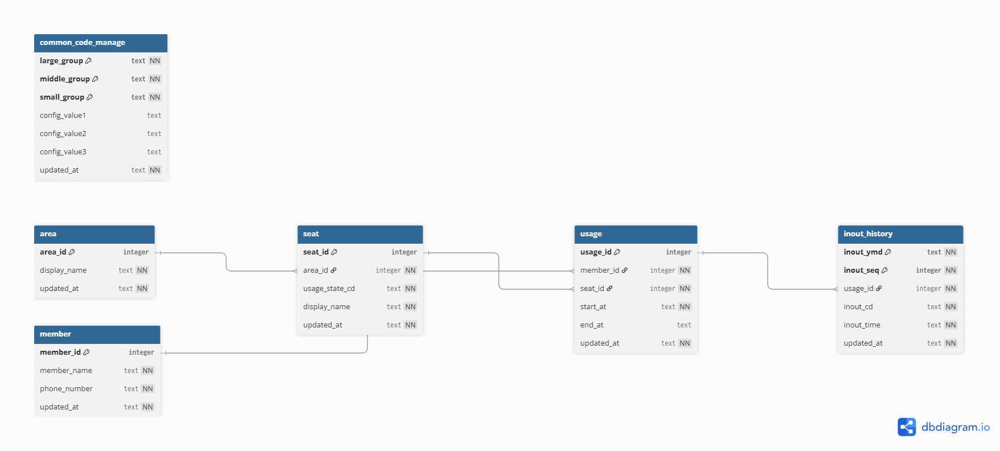

## 🧑‍💻 Seat Usage System

좌석 이용 상태를 관리하는 WPF 애플리케이션입니다.  
사용자가 좌석을 선택해 이용을 시작하고, 퇴실 처리까지 할 수 있습니다.

---

## Tech Stack

- C# 13 (.NET 9.0)
- WPF (Desktop Application)
- Entity Framework Core
- SQLite (Local Database)

---

## Features

- 좌석 상태 조회 (사용 가능 / 사용 중 / 사용 불가)
- 좌석 이용 및 퇴실 처리
- 사용자당 1좌석 이용 제한
- 좌석 이용 이력 관리

---

## Structure

- MVVM 패턴 기반
- 데이터 접근 로직 분리

---

## Database Design

- ERD Image

  
  

  
- 🔗 [Interactive ERD (dbdiagram.io)](https://dbdiagram.io/d/69f7299cc6a36f9c1bea07bc)

---

## Getting Started

```bash
git clone https://github.com/JinHyunHong/SeatUsageSystem.git
